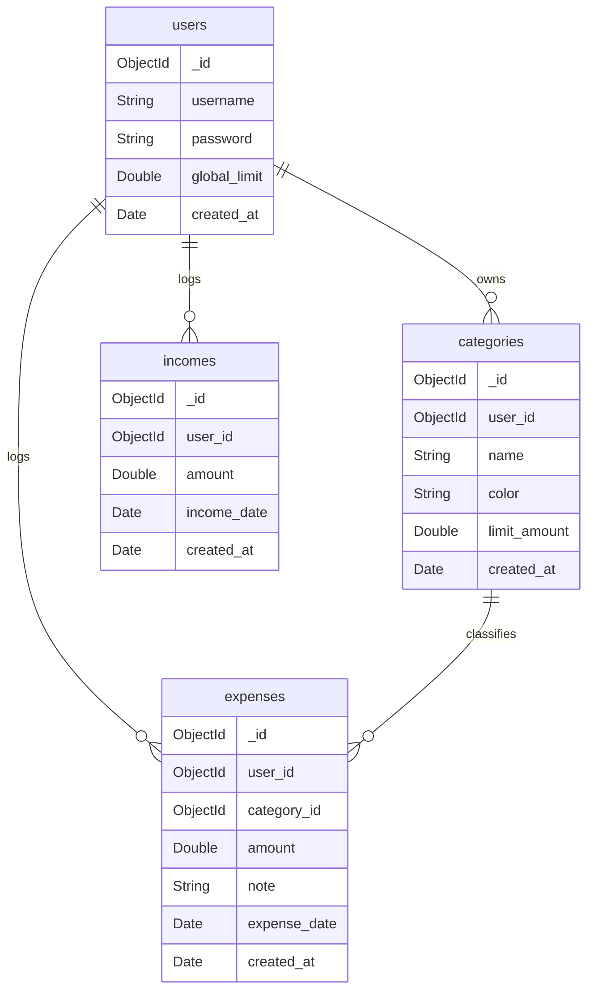

# 💰 Personal Finance Tracker

A full-stack, responsive Java web application for personal budget management, income & expense logging, category spending limit tracking, and real-time financial analytics. Built with **Java Server Pages (JSP)**, **Apache Tomcat**, and **MongoDB Atlas**.

[](https://personalfinancetracker-swag.onrender.com)


---

## 🌐 Live Demo & Presentation

* 🚀 **Live Web Application**: [https://personalfinancetracker-swag.onrender.com](https://personalfinancetracker-swag.onrender.com)
* 🎨 **Canva Presentation**: [View Design Deck & Architecture Slide](https://www.canva.com/design/DAG31lzOWok/ZTWPVUrooQN2qPFIqAP8uQ/view?utm_content=DAG31lzOWok&utm_campaign=designshare&utm_medium=link2&utm_source=uniquelinks&utlId=haabe31a3a5)

---

## ✨ Key Features

- 📊 **Financial Dashboard (`tracker.jsp`)**
  - Instant overview of Total Income, Total Expenses, Net Balance, and Global Budget Limit.
  - Interactive progress bar indicating percentage of global spending limit reached.
  - Quick income entry form and limit configuration.

- 🏷️ **Category Management (`categories.jsp`)**
  - Create customizable spending categories with custom names and assigned color badges.
  - Define custom spending limits per category.
  - Track individual category totals with percentage progress indicators.
  - Built-in fallback demo mode for seamless offline testing.

- 📈 **Visual Statistics & Analytics (`statistics.jsp`)**
  - High-performance MongoDB aggregation pipelines (`$match`, `$group`, `$sum`).
  - Categorical expense breakdown percentages and spending distribution.

- 📜 **Recent Transactions (`recent.jsp`)**
  - Chronological transaction log listing recent expenses sorted by date (`created_at` descending).
  - Displays category color badges, descriptions/notes, timestamps, and amounts.

- 🧮 **Built-in Financial Calculator (`calculator.jsp`)**
  - Integrated math expression calculator to perform quick financial calculations directly within the app.

- 🔒 **Security & Input Sanitization**
  - Session-based authentication ([login.jsp](login.jsp), [register.jsp](register.jsp)).
  - CSRF Token generation and validation on state-modifying actions.
  - Comprehensive XSS prevention and numerical input sanitization.
  - Dark Mode support with smooth theme toggle.

---

## 🛠️ Tech Stack & Architecture

- **Backend Logic**: Java Server Pages (JSP), Java 17, Servlet 5.0 API
- **Web Application Server**: Apache Tomcat 9
- **Database**: MongoDB Atlas (Cloud NoSQL), MongoDB Java Sync Driver v4.4.0
- **Deployment Host**: Render Cloud Platform
- **Frontend UI**: Bootstrap 5.3, FontAwesome 6, Custom Glassmorphic Vanilla CSS
- **Containerization**: Docker (`tomcat:9-jdk17-openjdk`)

---

## 📂 Project Structure

```text
myapp/
├── Dockerfile                   # Docker build instructions (Tomcat 9 JDK 17)
├── login.jsp                    # Glassmorphism User Login page
├── register.jsp                 # User Account Registration page
├── logout.jsp                   # Session Invalidation handler
├── tracker.jsp                  # Main Financial Dashboard & Income logger
├── categories.jsp               # Category manager & limit allocation
├── statistics.jsp               # Spending analytics & MongoDB aggregation
├── recent.jsp                   # Transaction history log
├── calculator.jsp               # Built-in math expression calculator
├── test_mongo.jsp               # MongoDB Atlas connection diagnostic page
├── db.jsp                       # Legacy MySQL connection utility
├── icon.png                     # Application favicon asset
├── WEB-INF/
│   ├── web-xml                  # Deployment descriptor (Welcome file config)
│   ├── config.properties.example# Environment configuration template
│   └── lib/                     # MongoDB Java Driver JARs (bson, driver-core, driver-sync)
└── README.md                    # Project documentation
```

---

## 🗄️ Database Schema (MongoDB `finance_tracker`)

The application connects to a cloud-hosted MongoDB Atlas database named `finance_tracker` with 4 core collections:



---

## 🚀 Getting Started

### Prerequisites

- **Java Development Kit (JDK)**: Java 11 or Java 17
- **Apache Tomcat Server**: Tomcat 9.0+
- **MongoDB Database**: Local MongoDB instance or free [MongoDB Atlas Cluster](https://www.mongodb.com/cloud/atlas)
- *(Optional)* **Docker**: Docker Engine for containerized deployment

---

### Installation & Local Setup

1. **Clone the repository**:
   ```bash
   git clone https://github.com/Ajaykumarnachimuthu/Personal-Finance-Tracker.git
   cd Personal-Finance-Tracker
   ```

2. **Configure Database Connection**:
   - Copy the example config file:
     ```bash
     cp WEB-INF/config.properties.example WEB-INF/config.properties
     ```
   - Open `WEB-INF/config.properties` and replace the URI with your MongoDB connection string:
     ```properties
     mongodb.uri=mongodb+srv://<username>:<password>@cluster0.example.mongodb.net/?retryWrites=true&w=majority
     ```
   - Alternatively, set the environment variable `MONGODB_URI` (used automatically on Render):
     ```bash
     export MONGODB_URI="mongodb+srv://<username>:<password>@cluster0.example.mongodb.net/finance_tracker"
     ```

3. **Deploy to Apache Tomcat**:
   - Copy the project directory to your Tomcat `webapps` folder:
     ```bash
     cp -r . /path/to/tomcat/webapps/myapp
     ```
   - Start Apache Tomcat:
     - **Windows**: `bin\startup.bat`
     - **Linux/macOS**: `bin/startup.sh`
   - Access the application in your browser at:
     ```text
     http://localhost:8080/myapp/
     ```

---

## 🐳 Docker Deployment

To build and run the application using Docker:

1. **Build the Docker image**:
   ```bash
   docker build -t finance-tracker .
   ```

2. **Run the Docker container**:
   ```bash
   docker run -d -p 8080:8080 -e MONGODB_URI="your_mongodb_uri" --name finance-tracker-app finance-tracker
   ```

3. Open your browser and navigate to `http://localhost:8080/`.

---

## 🔒 Security Highlights

- **CSRF Defense**: Cryptographically random UUID tokens generated per user session and validated on POST operations.
- **XSS Prevention**: Mandatory HTML entity encoding on user-supplied strings before DOM insertion.
- **Input Validation**: Strict regular expression checks on numerical amounts and ObjectId format validation (`24-digit hex string`).

---

## 🤝 Contributing

Contributions, issues, and feature requests are welcome! Feel free to check the [issues page](https://github.com/Ajaykumarnachimuthu/Personal-Finance-Tracker/issues).

1. Fork the Project
2. Create your Feature Branch (`git checkout -b feature/AmazingFeature`)
3. Commit your Changes (`git commit -m 'Add some AmazingFeature'`)
4. Push to the Branch (`git checkout -b feature/AmazingFeature`)
5. Open a Pull Request

---

## 📝 License

Distributed under the MIT License. See `LICENSE` for more information.

Developed by [Ajaykumar N](https://github.com/Ajaykumarnachimuthu)
